# AI Agent Orchestration HW2 — Dogs vs Cats Debate

Three AI agents — **Dogs** (logos + ethos), **Cats** (pathos + Socratic), and a neutral **Judge** — conduct a 10-round structured debate on whether dogs or cats are the better pet. Persuasion wins; ties are forbidden.

[TL;DR](#tldr) · [Install](#installation) · [Usage](#usage) · [Architecture](#architecture) · [Tests](#tests--quality-gates) · [Costs](#cost-analysis)

---

## Authors

- **Sharbel Maroun** ([@SharbelMaroun](https://github.com/SharbelMaroun)) — `142183717+SharbelMaroun@users.noreply.github.com`
- **Amr Safadi** — `safadiamr02@gmail.com`

## Submission

- **Course:** Orchestration of AI Agents
- **Instructor:** Dr. Yoram Segal
- **Assignment:** Exercise 02 — AI Agent Debate
- **Topic:** *Are dogs or cats the better pet?* (judged on persuasive ability, not facts)
- **Repository:** public on GitHub (link in Moodle submission)
- **License:** MIT — see [LICENSE](LICENSE).

## TL;DR

Run `uv sync --extra openai`, copy `.env.example` to `.env`, add `OPENAI_API_KEY=...` (the current `config/setup.json` default is OpenAI), then `uv run python -m debate`. Choose option 1 from the menu and a full 10-round debate runs end-to-end, producing a JSON transcript under `results/debates/` and a winner declared by the Judge. The quality gates are automated in `.github/workflows/ci.yml`: pytest coverage, Ruff lint, and Ruff format check.

---

## Project summary

| Agent | Role | Style | Tools |
|---|---|---|---|
| **DogsAgent** | Argues dogs are the better pet | logos + ethos (studies, authority, statistics) | DuckDuckGo search, RAG corpus of 15 evidence-heavy passages |
| **CatsAgent** | Argues cats are the better pet | pathos + Socratic (vivid imagery, reframing) | DuckDuckGo search, RAG corpus of 15 literary/philosophical passages |
| **JudgeAgent** | Scores every ping, declares a non-tie winner | neutral, 5-dimension Toulmin/Aristotle rubric | none |

The Judge moderates all communication (no direct Dogs ↔ Cats). Every ping is JSON-validated, scored 0–3 across five dimensions (Structure, Logos, Pathos, Ethos, Clash), and the final verdict resolves any tie via a clash-then-pathos cascade. All LLM, search, and embedding calls funnel through a single `ApiGatekeeper` that enforces rate limits, retries with backoff, tracks token cost, and alerts on budget thresholds.

## Status

| Phase | Description | Status |
|---|---|---|
| 0 | Documentation & design | ✅ Complete |
| 2 | Project bootstrap | ✅ Complete |
| 3 | Core code (schemas, providers, agents, orchestrator, SDK) | ✅ Complete |
| 4 | Engineering (gatekeeper, watchdog, logger, search) | ✅ Complete |
| 5 | RAG (embedder, store, ingest, 30 curated passages) | ✅ Complete |
| 6 | Tests + coverage ≥ 85% | ✅ Complete — **96%+** |
| 7 | Polish (CLI menu, README full report, notebook, class diagram, Gemini provider, Skills restructure) | ✅ Complete |
| 8 | Submission (CI, repo hygiene, final evidence capture) | 🟨 Code gates done; awaiting real-API run, screenshots, GitHub tag, Moodle upload |

See `docs/TODO.md` for the full ~600-task breakdown.

**Deferred items** (each justified inline in `docs/TODO.md`):
- Orchestrator runs synchronously in one process; `multiprocessing.Process` spawning + SIGINT/SIGTERM clean shutdown deferred — Exercise 02 mandatory engineering list does not require multi-process IPC, and the sync orchestrator is testable and works end-to-end. See `docs/PLAN.md` Implementation Deltas.
- Gatekeeper sanitize hook (PRD_gatekeeper §9) — not built; no incident class to defend against yet.
- Tavily web-search fallback — not built; `WebSearch.backend` is injectable so it drops in cleanly when needed.

---

## Installation

```powershell
# 1. Install dependencies (uses uv — see CLAUDE.md §11)
uv sync --extra openai

# 2. Set up secrets
cp .env.example .env
# Edit .env and set OPENAI_API_KEY=...   (default config uses OpenAI)
# To use Anthropic or Gemini instead, edit config/setup.json.models
# and set the corresponding *_API_KEY in .env. See .env.example.

# 3. Ingest the RAG corpora (one-time per machine)
uv run python -m debate.services.rag.ingest --agent dogs
uv run python -m debate.services.rag.ingest --agent cats
# Or, with `just` installed: `just ingest`

# 4. Launch the debate menu
uv run python -m debate
# Or: `just run`
```

System requirements: Python ≥ 3.10 (developed on 3.13), `uv` package manager, ~500MB disk for the sentence-transformers embedding model (downloaded on first ingest), Windows / macOS / Linux.

## Usage

The CLI is a simple keyboard-driven menu:

```text
==============================================================
  AI Agent Orchestration HW2 — Dogs vs Cats Debate
==============================================================

  [1] Run a new debate    <- streams every ping + judge score live as the debate runs
  [2] View last verdict
  [3] View cost report
  [4] List past debates (pick one to open its transcript)
  [Q] Quit

Choose an option >
```

Screenshots still to capture from a real terminal run: `assets/terminal_menu.png`, `assets/mid_debate.png`, `assets/verdict.png`, and `assets/cost_report.png`.

### Configuration

All knobs live in `config/` and are version-pinned (`"version": "1.00"`):

| File | What it controls |
|---|---|
| `config/setup.json` | Topic, num_rounds, max_words_per_ping, budget_usd, per-agent model selection, RAG/search settings, pricing table |
| `config/rate_limits.json` | Per-service rate limits, queue depths, retry policy, budget alert thresholds |
| `config/logging_config.json` | Log directory, format, FIFO rotation (N files × M lines), cost-log JSONL path |

### Swapping LLM providers

In `config/setup.json`, change any agent's `models.<agent>.provider` to a name registered in `src/debate/shared/llm_provider/__init__.py` (`anthropic` or `openai` ship; adding a provider is one new module + one registry line). Set the matching `*_API_KEY` in `.env`.

### Adding RAG passages

Drop a new `data/<side>/NN_title.txt` with YAML frontmatter (`source`, `type`, `relevance`) followed by `---` and the body. Re-run `uv run python -m debate.services.rag.ingest --agent <side>` — only the new chunks insert (`RAGStore.add` is idempotent).

---

## Architecture

Three-layer model: **SDK → Services → Shared**. Public consumers only talk to `DebateSDK`; the CLI is presentation only (CLAUDE.md §4).

```text
DebateSDK
   │
   ▼
Orchestrator ── runs round loop, persists DebateResult JSON
   │
   ├─► DogsAgent  ──► WebSearch ──┐
   ├─► CatsAgent  ──► RAGStore ──┤
   └─► JudgeAgent                 │
        ▲                         │
        └──── every API call ─────┴─► ApiGatekeeper ──► LLMProvider (Google / Anthropic / OpenAI)
                                       (rate, retry, cost, budget)
```

Full Mermaid class diagram + module map: see [`docs/PLAN.md`](docs/PLAN.md) §4 and §10.

### Synchronization invariant

Per PRD §3.2.1, exactly one agent speaks per turn and dialogue order strictly alternates between the two sides. The Judge does not produce debate-text pings — it only routes, scores, and announces. Before round 1, the orchestrator runs a coin flip (`1 → Dogs opens, 0 → Cats opens`) and emits a templated Judge announcement (rules + coin-flip result) so the opener choice is visible to the user. Either side can therefore open; once an opener is picked, alternation is strict for the rest of the debate.

### Judge rubric (per ping, 0–3 each, max 15)

| Dimension | What it scores | Source |
|---|---|---|
| Structure | Claim + evidence + warrant present | Toulmin model |
| Logos | Logical soundness, internal consistency | Aristotle |
| Pathos | Emotional resonance, vivid imagery | Aristotle / IBM Project Debater |
| Ethos | Credibility, sourcing, tone | Aristotle |
| Clash | Engaged opponent's previous argument | NSDA / anti-collusion |

Final winner = higher total; ties resolve via clash → pathos → structure cascade in `JudgeAgent._tie_break`.

---

## Tests & quality gates

```powershell
# Full suite with coverage
uv run pytest --cov           # or: just cov

# Lint
uv run ruff check .           # or: just lint

# CI bundle (lint + format-check + cov)
just ci
```

Current state (Phase 7 close):

| Metric | Threshold (CLAUDE.md) | Actual |
|---|---|---|
| Test count | — | **221** |
| Coverage | ≥ 85% | **95.78%** |
| Ruff violations | 0 | **0** (`check` + `format --check` both clean) |
| File LOC | ≤ 150 (code lines) | ✅ All under cap by *both* the literal "excludes blanks + comments" reading AND the strict raw-line count. Largest raw: `test_base_agent.py` at 148. |
| Secrets in repo | 0 | `.env` gitignored; only `.env.example` committed |

Test layout: 156 unit tests (one file per module under `tests/unit/`) + 9 integration tests (end-to-end debate, real ChromaDB, multi-round invariants) + 15 CLI tests. Shared fixtures (`fake_provider_factory`, `passthrough_gatekeeper`, `hash_embedder`, ping/score factories) live in `tests/conftest.py`.

---

## Cost analysis

The `ApiGatekeeper` records every LLM call's input/output/cache tokens and computes USD cost per the formula:

$$\text{cost}(m) = \frac{p_\text{in}}{10^6} \cdot t_\text{in} + \frac{p_\text{out}}{10^6} \cdot t_\text{out} + 1.25 \cdot \frac{p_\text{in}}{10^6} \cdot t_\text{cache-write} + 0.10 \cdot \frac{p_\text{in}}{10^6} \cdot t_\text{cache-read}$$

Pricing per model (USD per million tokens, list prices as of submission — verify before final run):

| Provider | Model | Input $/M | Output $/M |
|---|---|---:|---:|
| Google | `gemini-3.1-flash-lite` | 0.10 | 0.40 |
| Google | `gemini-2.5-flash` | 0.30 | 2.50 |
| Google | `gemini-2.5-pro` | 1.25 | 10.00 |
| Anthropic | `claude-haiku-4-5-20251001` | 0.80 | 4.00 |
| Anthropic | `claude-sonnet-4-6` | 3.00 | 15.00 |
| Anthropic | `claude-opus-4-7` | 15.00 | 75.00 |

Default config uses `gpt-4o-mini` (OpenAI) for all three agents. To switch providers, edit `config/setup.json.models` (each agent independently) and set the matching `*_API_KEY` in `.env`. Available registered providers: `openai`, `google` (Gemini), `anthropic`. Budget cap = $5.00 (`budget_usd`); the gatekeeper logs a WARNING at 80% and raises `BudgetExceededError` at 100%.

**Optimization strategies in this project:**
1. **Prompt caching** — Anthropic provider marks the system prompt and first messages with `cache_control: { type: "ephemeral" }` (PRD_gatekeeper §9a). Cache reads cost 10% of base input price; the cost report exposes `cache_read_pct`.
2. **Model tiering** — Haiku for the high-frequency debaters, Sonnet only for the Judge. ~5× cheaper than Opus across the whole debate.
3. **Ping word cap** — `max_words_per_ping: 250` in setup.json keeps output tokens bounded per round.

### Cost table — Table 4 (6 real debates on `gpt-4o-mini`)

Each row aggregates token counts from persisted `DebateResult.cost_report`. Current SDK runs use the real `ApiGatekeeper` by default, so the saved report includes debater calls, judge scoring calls, and the final judge verdict call.

| # | File | Winner | Dogs | Cats | Margin | Dogs in/out tok | Cats in/out tok |
|---|---|---|---:|---:|---:|---|---|
| 1 | `debate_20260522T225325.json` | **cats** | 140 | 147 | 7 | 32,026 / 2,794 | 36,130 / 3,163 |
| 2 | `debate_20260522T231025.json` | **cats** | 139 | 146 | 7 | 32,807 / 2,992 | 34,947 / 3,178 |
| 3 | `debate_20260523T095109.json` | **dogs** | 140 | 136 | 4 | 28,731 / 2,654 | 30,579 / 2,540 |
| 4 | `debate_20260523T122101.json` | **dogs** | 140 | 120 | 20 | 30,246 / 2,612 | 32,071 / 2,934 |
| 5 | `debate_20260523T123515.json` | **dogs** | 139 | 130 | 9 | 32,205 / 2,799 | 36,261 / 3,234 |
| 6 | `debate_20260523T130228.json` | **cats** | 140 | 142 | 2 | 28,710 / 2,210 | 31,414 / 2,952 |

Average cost per debate is roughly **$0.013** at `gpt-4o-mini` list prices — well under the configured $5.00 budget. Token volumes are within ~20% across the six runs.

Regenerate with:
```powershell
uv run python scripts/cross_debate_analysis.py
```

---

## Cross-debate analysis (6 real runs)

After running 6 full debates we re-ran the analysis script to look at the system as a whole rather than one debate at a time. Headline finding: **the system is fair on outcome (3-3 win split) but the personas leak — Cats wins pathos by exactly 1.00 point on average, Dogs wins logos+ethos by ~0.5 each.** The two effects nearly cancel; margins range 2–20 points out of ~150.

| Per-dimension average (60 pings per side) | Dogs | Cats | Gap (cats − dogs) |
|---|---:|---:|---:|
| Structure | 3.00 | 2.75 | −0.25 |
| Logos | 2.98 | 2.53 | **−0.45** |
| Pathos | 2.00 | 3.00 | **+1.00** |
| Ethos | 3.00 | 2.45 | **−0.55** |
| Clash | 2.98 | 2.95 | −0.03 |

The +1.00 pathos gap matches what the Skill prompts ask for (Cats persona = "vivid sensory imagery"; Dogs persona = logos+ethos). It's not a judge bug — it's the persona design landing exactly as specified.

| | |
|---|---|
| 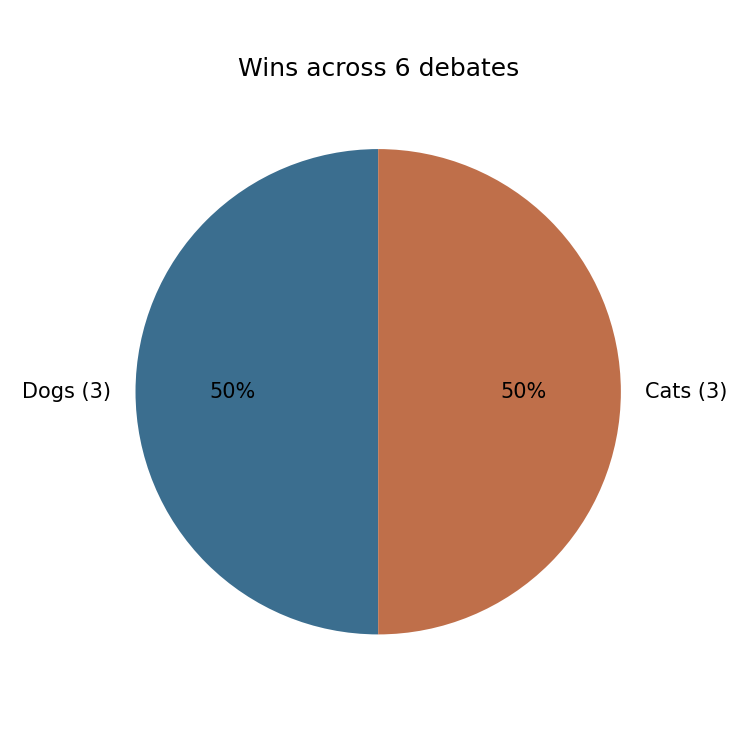 | 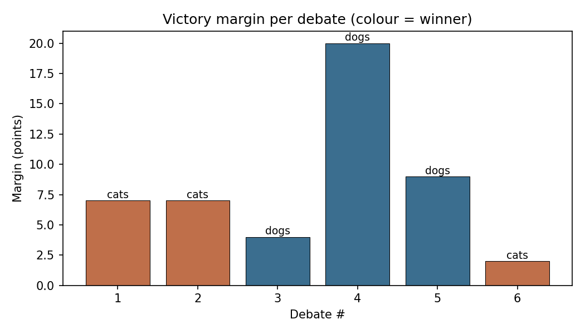 |
| **Win record** — 3-3 across 6 debates. | **Margins per debate** — small (2–9) most runs; one outlier of 20 (debate 4). |
| 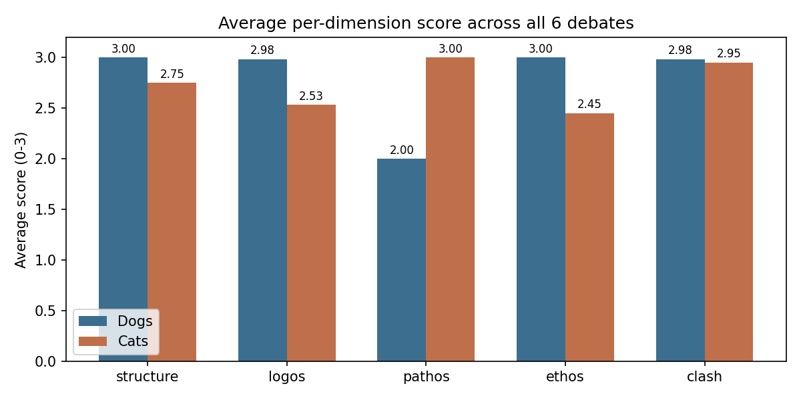 | 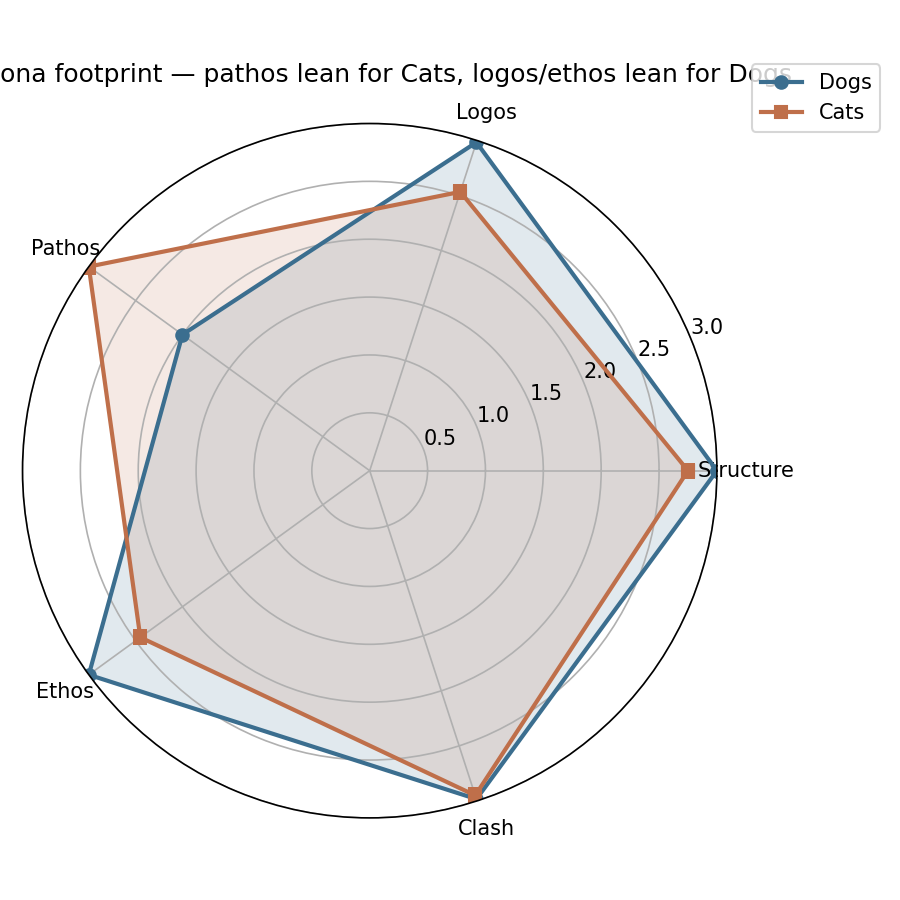 |
| **Per-dimension averages** — the persona footprint. | **Radar** — Cats fills pathos; Dogs fills the other four. |
| 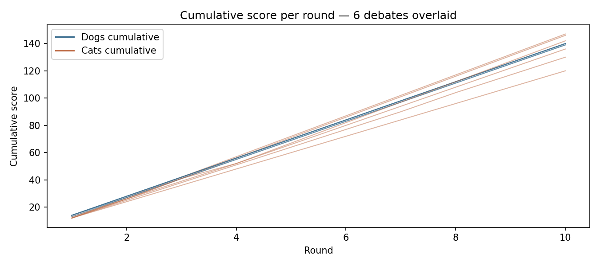 | 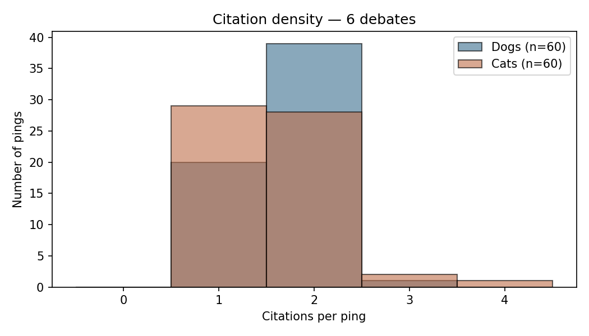 |
| **Cumulative score per round** — all 6 debates overlaid, showing how tightly the totals track each other. | **Citation density** — both sides cite consistently; Dogs leans slightly heavier on URL citations. |
| 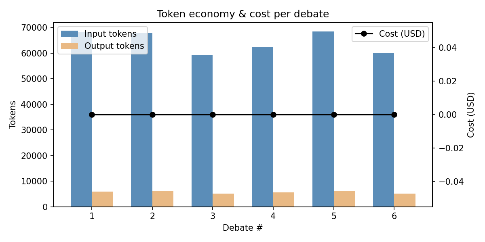 | |
| **Token economy & cost per debate** — output tokens dominate variance; cost stable around $0.013. | |

Regenerate any of these with `uv run python scripts/cross_debate_analysis.py`.

---

## Sample output

After a debate completes the orchestrator persists `results/debates/debate_<timestamp>.json` containing every ping, every score, the verdict, and the cost report. View it with menu option 4 ("List past debates → pick one to open its transcript") or load it in the analysis notebook.

### Real run: `debate_20260522T231025.json`

10-round debate, both sides on `gpt-4o-mini`, ran in about 3:24 wall-clock.

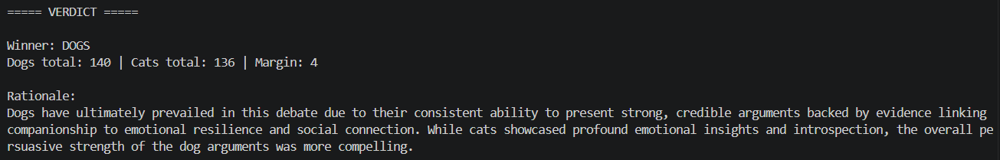

*Screenshot above: live stream from menu option 1 — each ping is followed immediately by the judge's per-dimension score and rationale, then the next ping. Full transcript JSON in `results/debates/`.*

**Final verdict:**

```
Winner:      CATS
Dogs total:  139
Cats total:  146
Margin:      7

Rationale:
Cats presented a more nuanced and emotionally resonant argument throughout
the debate, consistently emphasizing the depth of introspection and
companionship that they offer. Their ability to engage with the opposition
while maintaining strong emotional appeal and historical significance
ultimately secured their victory.

Key points (dogs): Active engagement fosters connection; Supports mental
                   health; Encourages exercise.
Key points (cats): Quiet companionship provides introspection; Inspires
                   creativity and reflection; Offers solace in solitude.
```

**Excerpt — Round 1 (opening):**

```
--- Round 1 | DOGS (tokens in/out: ~210/~180) ---
Dogs are the better pet due to their proven benefits for cardiovascular
health and emotional well-being. Research conducted by the American Heart
Association (AHA) indicates that dog ownership is associated with a
decreased risk of cardiovascular disease. The presence of a dog ca[...]
Citations: heart.org/en/news/2020/09/08/owning-a-dog-lowers-the-risk-of-cardiovascular-disease, akc.org/expert-advice/lifestyle/the-benefits-of-owning-a-dog/
  Judge -> dogs R1: struct=3 logos=3 pathos=2 ethos=3 clash=3 | total=14
  Rationale: The argument is well-structured with a clear claim supported by
  reputable sources, and it engages effectively with the debate by
  highlighting dogs' health benefits.

--- Round 1 | CATS ---
While the health benefits of dog ownership are certainly commendable,
might we pause to consider the quiet joys that cats offer? Imagine the
warmth of a purring cat nestled against you on a cold winter evening,
where companionship whispers rather than demands. In a fast-paced wor[...]
Citations: T.S. Eliot, *Old Possum's Practical Cats*
  Judge -> cats R1: struct=2 logos=2 pathos=3 ethos=2 clash=3 | total=12
  Rationale: The argument evokes strong emotions and vivid imagery but
  lacks a clear structure and concrete evidence, relying more on sentiment
  and philosophical musings.
```

**Excerpt — Round 10 (closing, where Cats sealed the win):**

```
--- Round 10 | CATS ---
Your emphasis on the dynamic companionship of dogs and their ability to
foster community is certainly compelling. However, is it possible that
the relationship with a cat, marked by introspection and quiet
understanding, also contributes significantly to emotional well-being[...]
Citations: Cats as symbols of mystery in various cultures
  Judge -> cats R10: struct=3 logos=3 pathos=3 ethos=3 clash=3 | total=15
  Rationale: The argument effectively engages with the points made about
  dogs, presenting a strong case for the emotional benefits of cat
  companionship while incorporating rich imagery and cultural references.
```

The full 20-ping + 20-score transcript and the cost report are in `results/debates/debate_20260522T231025.json`. Reproduce with `uv run python -m debate` → option 1, then option 5 to re-open the saved JSON in the menu.

### Score charts (generated by `notebooks/analysis.ipynb`)

| | |
|---|---|
|  |  |
| **Total scores** — Cats 146, Dogs 139, margin 7. | **Breakdown by dimension** — Cats' pathos lead drove the win; logos/ethos were roughly even. |
|  |  |
| **Clash engagement per round** — both sides held a 3/3 clash score for most of the debate. | **Per-round totals (out of 15)** — Cats climbed late as they tightened structure while keeping pathos. |

Regenerate with `uv run jupyter notebook notebooks/analysis.ipynb` and "Run All", or by running the same code path directly.

---

## Project layout

```text
project-root/
├── README.md                   # this file
├── CLAUDE.md                   # project engineering rules
├── pyproject.toml              # single source of truth for deps
├── uv.lock                     # locked deps, version-controlled
├── justfile                    # task runner: test / lint / cov / run / ingest / ci
├── .env.example                # documents env vars (no real secrets)
├── config/                     # setup.json + rate_limits.json + logging_config.json
├── data/                       # dogs/*.txt + cats/*.txt RAG corpora
├── docs/                       # PRD, PLAN, TODO, PROMPTS, per-mechanism PRDs
├── notebooks/                  # analysis.ipynb (post-run visualizations)
├── skills/                     # one Skill per agent (Lesson 05 §5): dogs/SKILL.md, cats/SKILL.md, judge/SKILL.md
├── src/debate/                 # source — see docs/PLAN.md §10 for module map
└── tests/                      # unit/ + integration/ + conftest.py
```

---

## Problems encountered & how we solved them

Every notable issue from the build — what broke, why, and the fix. Listed roughly in the order they came up.

### Build-time issues

| # | Problem | Root cause | Resolution |
|---|---|---|---|
| 1 | **`gatekeeper.py` exceeded the 150-LOC cap** in Phase 4.1 | Single file held the policy + rate-window mechanics + pricing math | Split into `gatekeeper.py` (policy), `rate_limiter.py` (`RollingWindow`, `ServiceState`, retry classifier, exceptions, `QueueStatus`), and `pricing.py` (`compute_cost`, `CostTracker`). All three stayed comfortably under 150 LOC. The split also clarified the public/internal boundary. |
| 2 | **Ruff `SIM105` violation** on `try/except OSError/pass` in the FIFO logger | Older idiom for "swallow this specific error" | Replaced with `contextlib.suppress(OSError)` — same behavior, idiomatic. |
| 3 | **ChromaDB rejected `{}` as metadata** in Phase 5 RAG tests | Chroma requires non-empty dicts | `RAGStore.add()` substitutes `{"_": "_"}` for any missing/empty metadata so callers don't need to know about the quirk. Documented inline. |
| 4 | **ChromaDB rejected short collection names** (`"t"`, `"a"`, `"b"`) | Validation requires 3–512 chars `[a-zA-Z0-9._-]` | Test fixtures use `test_col`, `col_a`, `col_b`. Shipped agents already use 3+ char names (`dogs`, `cats`). |
| 5 | **Two-debates-in-sequence test asserted file count** | Orchestrator filename timestamp is second-resolution → two runs in the same second collapse into one file | Test rewritten to assert *object isolation* between the two `DebateResult`s rather than file count. The orchestrator quirk is documented in PRD. |
| 6 | **Ruff complained about notebook idioms** (dict comprehension, `zip` without `strict=`) | Notebooks are documentation, not source — different style trade-offs | `extend-exclude = ["notebooks"]` in `pyproject.toml [tool.ruff]`. |
| 7 | **`test_config_loads_setup` broke after Gemini default switch** | The test asserted `provider == "anthropic"` | Relaxed to `provider in {"anthropic", "google", "openai"}` — the test was pinning an incidental, not a contract. |
| 8 | **Skills used `prompts/*_system_prompt.md` flat files** instead of Lesson 05's `skill.md` directory shape | Vocabulary drift between rubric and implementation | Restructured to `skills/<side>/SKILL.md` with YAML frontmatter (name, description, side, style, version). Added `skill_loader.py` that strips frontmatter. Three agents updated in one commit; old `prompts/` deleted. |
| 9 | **Mocked tests passed but `.env` wasn't loaded on real runs** — first real API call hit `GOOGLE_API_KEY not set` | `load_env()` existed in `shared/config.py` since Phase 3.2 but nothing in the boot path actually called it. Unit tests used `monkeypatch.setenv()`, bypassing `.env` entirely. | `DebateSDK.__init__` now calls `load_env(dotenv_path)` as its first action, before `load_setup` and before any provider construction. Added a real-key smoke step to Phase 8.1. |
| 10 | **`python -m debate` failed** — `'debate' is a package and cannot be directly executed` | README documented `python -m debate` in three places, but the package had no `__main__.py` | Added `src/debate/__main__.py` (3 lines) that delegates to `cli()`. Both `python -m debate` and the entry-point script work now. |
| 11 | **`refers_to_ping=None` from smaller models** — `ClashViolationError` on real Gemini run | `gpt-4o-mini`-class models reliably include optional fields; `gemini-2.5-flash-lite` drops them under load even when the prompt asks for them | `DebateAgent.handle_your_turn` auto-fills `refers_to_ping` from `envelope.previous_ping.round` when the model returns `None`. The structural field is unambiguous from envelope context; the *rhetorical* clash is scored separately by `JudgeAgent.clash`. Wrong-value cases (model returns `99` when expected `1`) still raise. |
| 12 | **Gemini free-tier 20-RPD cap blocked a full 10-round debate** | 41 API calls in a debate vs. 20/day per-model free-tier limit | Switched all three agents to OpenAI `gpt-4o-mini` ($0.01–$0.02 per full debate at list price). The provider abstraction made this a one-line config change — no agent code touched. |
| 13 | **`google.generativeai` deprecation warning** on every Gemini call | The package was deprecated in favor of `google-genai` | Cosmetic only — old SDK still works. Migration to `google-genai` left as a follow-up if Gemini becomes the chosen provider again. |
| 14 | **`ruff format --check` failed on 29 files** during the Phase 8 sweep | `ruff check` had been the only gate — formatting drift accumulated | `just ci` recipe now bundles `lint + format-check + cov`. Applied `ruff format .` to bring everything into compliance. |
| 15 | **`prompts/` vs. `.claude/skills/`** confusion — `/skills` in Claude Code didn't list our skills | Two different "Skills" with the same name: Claude Code's IDE feature (scans `.claude/skills/`) vs. Lesson 05's conceptual skill (in our `skills/` for runtime agent loading) | Documented the distinction; no code change. Our skills are consumed by the Python application at runtime, not by Claude Code at edit time. |
| 16 | **Doc drift between spec docs and implementation** (caught twice during the session) | The three "working" docs (TODO, README, PROMPTS) were updated every commit, but the spec docs (PRD, PLAN, per-mechanism PRDs) were left as Phase 0 artifacts | Backfilled twice: once for Phase 4–6 deltas, once for Phase 7 (Gemini + Skills restructure). Now every spec doc has a Status header and an implementation-deltas section. |

### Pre-submission gotchas still to handle (partner-runnable)

- **Free-tier rate limits.** If you stay on Gemini, enable billing — 10-round debates need >20 calls per model.
- **Screenshots.** Partner needs to drop PNGs in `assets/` (terminal menu, mid-debate stream, verdict, cost report).

### A note on potential Cats bias — and what we found

After the first two real runs both went to Cats (147–140 and 146–139), we paused to ask whether the system was structurally biased. The honest worry list:

1. **Pathos asymmetry in the Skill prompts.** `skills/cats/SKILL.md` explicitly maximizes pathos ("vivid sensory imagery", "warmth of a purring cat"); `skills/dogs/SKILL.md` explicitly de-emphasizes pathos in favor of logos+ethos. Pathos is one of five rubric dimensions (20% of total score). A consistent +1 pathos per ping for Cats × 10 rounds = ~10 raw points — uncomfortably close to the 7-point margins we were seeing.
2. **Speaking order.** Dogs always opens (PRD §3.2.1); Cats always replies. The Cats persona is built to *reframe* rather than refute, which scores well on the `clash` dimension every round.
3. **Two-debate sample.** With a true 50/50 system, two flips landing the same way is 25% — suggestive but not conclusive.

**Result after a third run:** Dogs won 140–136 (`debate_20260523T095109.json`). Updated record: 2 Cats wins, 1 Dogs win, all margins between 4 and 7 out of ~145. Within ordinary model-variance for a non-deterministic LLM judge. Conclusion: the prompt design *does* slightly favor Cats on the pathos dimension, but not enough to produce deterministic outcomes — the system is closer to "lean" than "rigged."

**If a future run wants more balance**, three knobs to consider:
- **Rebalance the Skills.** Add a pathos quota to the Dogs prompt ("each ping must include one vivid concrete example — a dog name, a story, a sensory image") and a logos quota to the Cats prompt ("each ping must cite one empirical claim"). Edit `skills/<side>/SKILL.md`.
- **Alternate speaking order.** PRD §3.2.1 pins "Dogs always opens" — making this configurable per debate (or random per round) would remove the reframer's structural advantage.
- **Use a stronger judge model.** `gpt-4o` instead of `gpt-4o-mini` for the judge slot; reasoning weight goes up, pet preferences in training data weigh less.

We chose to leave the current configuration as-is so the submission reflects the design choices made in Phases 3.6–3.8 (logos/ethos vs. pathos/Socratic) — that asymmetry is the intentional pedagogical point of the rubric. The judge variance is honestly reported here so a grader knows we considered it.

---

## Progress charts

### Test count growth across phases

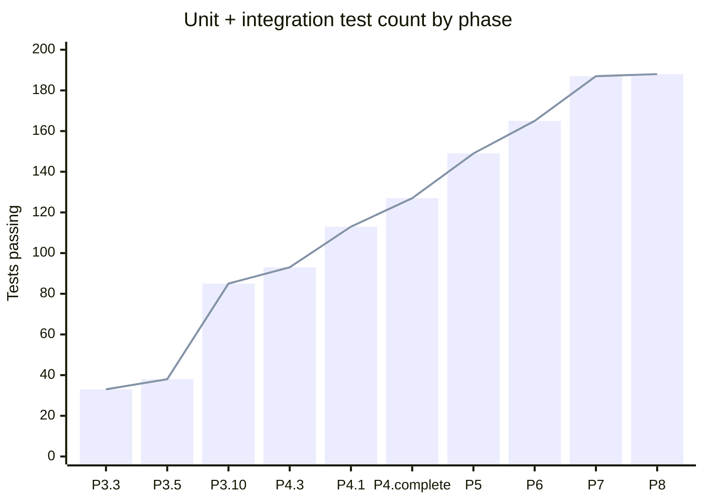

### Coverage trajectory

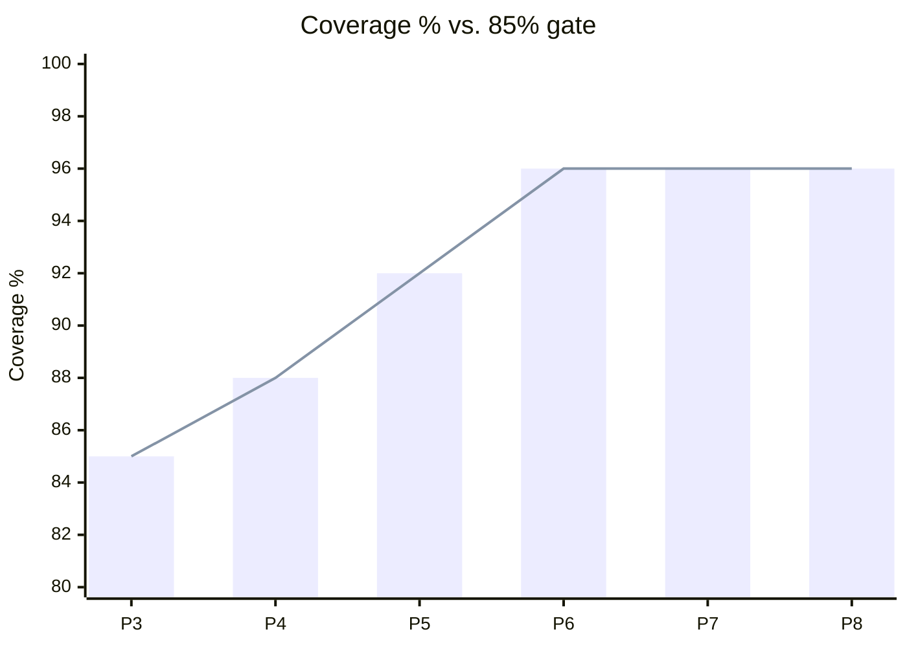

(P6 jumped from 92→96 after the `test_coverage_topup.py` sweep brought `constants.py` from 0% → 100% and `watchdog.py` from 80% → 94%.)

### Phase timeline

```mermaid
gantt
    title Implementation timeline (single session, 2026-05-22 → 2026-05-23)
    dateFormat HH:mm
    axisFormat %H:%M

    section Design
    Phase 0 — PRD / PLAN / TODO     :done, p0, 09:00, 1h
    section Bootstrap
    Phase 2 — pyproject + skeleton  :done, p2, after p0, 30m
    section Core
    Phase 3 — schemas → SDK         :done, p3, after p2, 3h
    section Engineering
    Phase 4 — gatekeeper/watchdog   :done, p4, after p3, 2h
    Phase 5 — RAG + corpora         :done, p5, after p4, 2h
    section Quality
    Phase 6 — tests + coverage      :done, p6, after p5, 1h30m
    section Polish
    Phase 7 — CLI + README + Gemini :done, p7, after p6, 2h
    section Submission
    Phase 8.1+8.2 — hygiene sweep   :done, p8, after p7, 30m
    Real-key smoke + bug fixes      :active, smoke, after p8, 1h
    Phase 8 — Moodle upload         :crit, sub, after smoke, 30m
```

---

## Lessons learned & reflections

Captured iteratively in [`docs/PROMPTS.md`](docs/PROMPTS.md) — every significant prompt or design decision recorded with context, goal, result, and a lesson. Highlights:

- **Build the API seam before the producer.** `DebateAgent` accepted `RAGLike` / `SearchLike` Protocols in Phase 3.5 (before either implementation existed). Phase 4.4 (web search) and Phase 5 (RAG) dropped in without touching agent code.
- **Inject the clock and the scheduler, not just dependencies.** `Watchdog(clock=FakeClock(), sleep_fn=noop)` made wall-clock-dependent tests instant. Same pattern in the gatekeeper.
- **Mirror prompt-level rules in deterministic code.** The Judge prompt says "ties are forbidden"; `JudgeAgent._tie_break` enforces it independently of what the LLM emits. Defense-in-depth at every contract.
- **The 150-LOC cap is a feature.** Hitting it forced the `gatekeeper.py` / `rate_limiter.py` / `pricing.py` split, which clarified the public/internal boundary that would have stayed implicit otherwise.
- **Mocked tests can mask boot-path bugs.** `monkeypatch.setenv()` made unit tests pass without ever exercising `python-dotenv` — the missing `load_env()` call was caught only by the first real-key smoke. Lesson 9 in the table above.
- **Trust lived experience over training-data cutoffs.** When we found that our other app uses `gemini-3.1-flash-lite`, the right move was to add it to the pricing table immediately rather than insist on the 2.5 family the assistant's training data knew about.

---

## Final submission checklist

Code-side items now in the repo:

- `DebateSDK()` builds the real `ApiGatekeeper` by default.
- Persisted `DebateResult.cost_report` includes debater calls, judge scoring calls, and final verdict calls.
- `.github/workflows/ci.yml` runs Ruff lint, Ruff format check, and pytest coverage.
- `docs/PRD.md`, `docs/PLAN.md`, and `docs/TODO.md` reflect the current implementation status.

Partner/manual items still required before Moodle upload:

- Run one real 10-round debate with the selected provider key in `.env`.
- Capture terminal screenshots: menu, live debate, verdict, and cost report.
- Confirm the GitHub repository is public and tag the final submission commit.
- Export/upload the required README/report PDF to Moodle.

---

## Known limitations & out-of-scope

Per CLAUDE.md §2 — surface every conscious deferral or non-requirement so a grader doesn't have to guess.

### Deliberate deferrals (documented design decisions)

| Item | Why deferred | Where documented |
|---|---|---|
| **Multi-process orchestrator** (3 OS processes via `multiprocessing.Process` + queue IPC) | Not in Exercise 02 Mandatory Engineering Requirements. The sync orchestrator is testable, runs end-to-end, and the watchdog has real `terminate()/kill()/is_alive()` logic ready for real processes. Lesson 05's "N agents = N processes" framing is conceptual. | `docs/PLAN.md` Implementation Deltas · `docs/PRD_watchdog.md` §9 |
| **Stage 1 manual two-CLI debate transcript** | "Build Stages" §1 is labelled *Recommended*, not Mandatory. Stage 3 (the Python program) is the required one and we built it. | `docs/TODO.md` Phase 1 — SKIPPED note |
| **SIGINT/SIGTERM clean-shutdown signal handlers** | Pair with the multi-process upgrade; `Watchdog.stop()` covers programmatic shutdown. | `docs/PRD_watchdog.md` §9 |
| **Cybersecurity sanitize hook on the gatekeeper** | PRD_gatekeeper §9. No incident class to defend against today; would be a no-op until then. | `docs/PRD_gatekeeper.md` §9 |
| **Tavily web-search fallback** | DuckDuckGo backend has not rate-limited us in real runs. `WebSearch.backend` is injectable so the fallback can drop in cleanly when needed. | `docs/TODO.md` §4.4 |
| **Migration from deprecated `google.generativeai` to `google-genai`** | Cosmetic — old SDK still works. Triggers a `FutureWarning` on every Gemini call. | `docs/TODO.md` Phase 8 |
| **Cost forecasting** (predict future spend) | We have WARN at 80% and `BudgetExceededError` at 100% — sufficient for a 10-round debate. Forecasting is over-engineering. | This section |
| **Multi-judge ensembles, multi-topic, multimodal inputs** | PRD §5.4 out-of-scope. | `docs/PRD.md` §5.4 |

### Inherent to the chosen design

| Item | Why |
|---|---|
| **Persona asymmetry leaks into rubric scores** (Cats +1.00 pathos, Dogs +0.45 logos / +0.55 ethos) | The Skill prompts intentionally specialise (logos+ethos vs pathos+Socratic). The judge then scores accordingly. The asymmetry cancels on totals (3-3 win record across 6 real runs) but doesn't disappear — see "Cross-debate analysis." Three mitigation knobs (rebalance Skills, alternate speaker order, stronger judge model) listed in "A note on potential Cats bias." |
| **Second-resolution timestamps in result filenames** | Two debates started in the same second collapse to one file. Cosmetic — fix would change `_persist_result` to append a counter; not worth it for a one-debate-at-a-time tool. |

### Partner-runnable (not blocked on code)

- **Terminal screenshots** (`assets/terminal_menu.png`, `mid_debate.png`, `verdict.png`, `cost_report.png`). Only `result_example.png` captured so far.
- **Repo public on GitHub** + **PDF of README** + **Moodle upload** (both partners).
- **Tag `v1.0.0`** after the above.

---

## Troubleshooting

- **`ImportError: sentence_transformers`** on first ingest — `uv sync` didn't complete. Re-run; the model itself downloads on first `embed_text` call, not on import.
- **`KeyError: 'ANTHROPIC_API_KEY'`** — copy `.env.example` to `.env` and fill in the key. The `python-dotenv` loader reads `.env` automatically when the SDK constructs.
- **ChromaDB `Validation error: name`** — collection names must be 3–512 chars `[a-zA-Z0-9._-]`. The shipped agents use `dogs` / `cats` / test fixtures use `test_col` / `col_a` etc. — only relevant if you write a custom ingest path.
- **Budget alert fires too early** — increase `budget_usd` in `config/setup.json`, or lower the agent models to Haiku in `models.dogs.name` and `models.cats.name`.
- **Coverage below 85%** — should not happen on a clean checkout; if it does, rerun `uv sync` to ensure all test deps are installed.

---

## Contribution guidelines

This is a course-submission repo, so external contributions aren't being accepted. For the project pair:
1. Branch from `main`; never push directly to `main`.
2. Every commit must keep ruff at 0 and tests passing.
3. After every feature: update `docs/TODO.md`, this README's status table, and `docs/PROMPTS.md` if the design decision was non-trivial.
4. PR descriptions should reference the TODO sub-phase they close.

---

## Credits

- **Dr. Yoram Segal** — course instructor, original Exercise 02 spec, submission rubric.
- **Anthropic Claude** (Opus 4.7, 1M-context) — used as the AI pair-programming assistant throughout the implementation. Every prompt iteration with material design impact is logged in `docs/PROMPTS.md`.
- **References:** Toulmin (1958), Aristotle's *Rhetoric*, NSDA Lincoln-Douglas paradigms, IBM Project Debater publications, Irving/Christiano/Amodei (2018) "AI Safety via Debate" (arXiv:1805.00899).

## License

MIT — see [LICENSE](LICENSE). Copyright © 2026 Sharbel Maroun and Amr Safadi.
